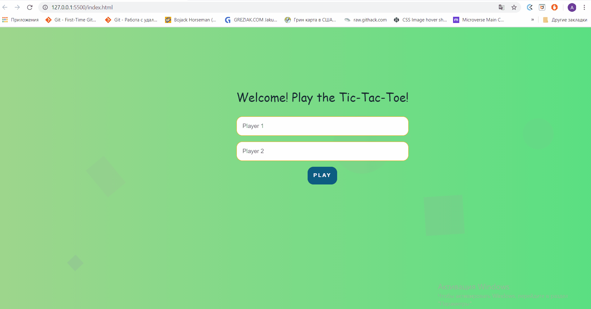

# Tic-Tac-Toe

Tic-tac-toe game with 3X3 board with sound effect and simple UI. Write your name and start to play a game. During the game, you will see scores of the players

# Features

- Two player
- Score table

## Built With Javascript

- HTML
- CSS
- JavaScript

## Future Improvements
- Use SASS for styling
- Add some bots to the game (play with Computer)
## Live Demo

[Live Demo Link](https://ansaryergesh.github.io/tic-tac-toe-js/)

## Screenshot

## Getting Started

To start to use this proyect download this repository to your computer and descompress all the files, after open your terminal from the containing folder and open the index.html file on Google Chrome browser.

### Setup

To use this project you will need to download this repository and save in your computer.

### Deployment

Steps to run the webpage on the browser:

- open the index.html file with any browser

## Author:

👤 **Ansar Yergeshov**

- Github: [@ansaryergesh](https://github.com/ansaryergesh)
- Twitter: [@ansaryergesh](https://twitter.com/ansaryergesh)
- Linkedin: [Ansar Yergeshov](https://www.linkedin.com/in/ansaryergesh/)
- Gmail: yergeshovansar@gmail.com

## 🤝 Contributing

Contributions, issues and feature requests are welcome!

Feel free to check the [issues page](issues/).

## Show your support

Give a ⭐️ if you like this project!

## Acknowledgments

This page was inspired by my own bussines i'm a food-seller on my free times while im not writing code.

## 📝 License

This project is [MIT](lic.url) licensed.
